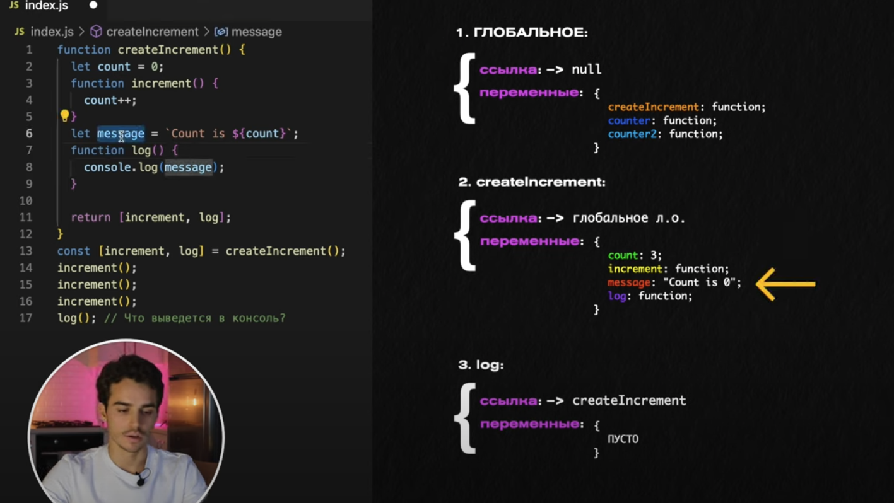

# Замыкание, область видимости

- В JavaScript у каждой выполняемой функции, блока кода `{...}` и скрипта есть связанный с ними внутренний (скрытый) объект, называемый лексическим окружением `LexicalEnvironment`.

Объект лексического окружения состоит из двух частей:***
    1. *Environment Record* – объект, в котором как свойства хранятся все локальные переменные (а также некоторая другая информация, такая как значение `this`).
    2. Ссылка на *внешнее лексическое окружение* – то есть то, которое соответствует коду снаружи (снаружи от текущих фигурных скобок).
    
    «Лексическое окружение» – это объект спецификации: он существует только «теоретически» в спецификации языка для описания того, как все работает. Мы не можем получить этот объект в нашем коде и манипулировать им напрямую.
    
    Замыкание – это функция, которая запоминает свои внешние переменные и может получить к ним доступ. В JavaScript, все функции изначально являются замыканиями (есть только одно исключение, про которое будет рассказано в [Синтаксис "new Function"](https://learn.javascript.ru/new-function)).
    
    То есть они автоматически запоминают, где были созданы, с помощью скрытого свойства `[[Environment]]`, и все они могут получить доступ к внешним переменным.



```jsx
const createIncrement = () => {
  let counter = 0;
  
  function incr() {
    counter++;
  }

  let message = `Counter = ${counter}`;

  function log() {
    console.log('--  message -->', message);
  }

  return [incr, log]
}
// Во время вызова log() внутри лексического окружения функции createIncrement
// меняется переменная counter, но переменная message НЕ МЕНЯЕТСЯ!!
// Поэтому вызов log() будет всегда возвращать 0;

const [incr, log] = createIncrement();
incr() 
log()  // 0
incr()
log()  // 0

// Пути решения:
// - переместить переменную message внутрь функции log()
// - сделать message - функцией let message = () => `Counter = ${counter}`
// - внутри log() использовать переменную counter, а не message напрямую
```

### Мёртвая зона

```jsx
Что выведет данный код?  Ответ: ошибка.

let x = 1;

function func() {
  console.log(x); // ?

  let x = 2;
}

func();
```

В этом примере мы можем наблюдать характерную разницу между «несуществующей» и «неинициализированной» («uninitialized») переменной.

Переменная находится в «неинициализированном» («uninitialized») состоянии с момента входа в блок кода (или функцию). И остается неинициализированной до соответствующего оператора `let`.

Другими словами, переменная технически существует, но не может быть использована до `let`.

Приведенный выше код демонстрирует это.

```
function func() {  
// локальная переменная x известна движку с самого начала выполнения функции,
// но она неинициализированна ("uninitialized") до let ("мёртвая зона")
// следовательно, ошибка

console.log(x); // ReferenceError: Cannot access 'x' before initializationlet x = 2;
let x = 2;
}
```

Эту зону временной непригодности переменной (от начала блока кода до `let`) иногда называют «мёртвой зоной».
