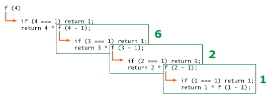

# Рекурсия и стек

- *Рекурсия* – это термин в программировании, означающий вызов функцией самой себя. 
2 условия:
- вызов внутри тела функции самой себя ( шаг рекурсии )
- базовый случай ( условие при котором рекурсия останавливается, возвращает какое то значение, а не вызов самой себя )

Когда функция вызывает саму себя, это называется *шагом рекурсии*. *База* рекурсии – это такие аргументы функции, которые делают задачу настолько простой, что решение не требует дальнейших вложенных вызовов.

Любая рекурсивная функция может быть переписана в итеративную. И это иногда требуется для оптимизации работы. Но для многих задач рекурсивное решение достаточно быстрое и простое в написании и поддержке.

[***Рекурсивно определяемая](https://en.wikipedia.org/wiki/Recursive_data_type) структура данных** – это структура данных, которая может быть определена с использованием самой себя.

**Рекурсивная** (рекурсивно определяемая) структура данных – это структура, которая повторяет саму себя в своих частях.*

### Контекст выполнения и стек, как работают рекурсивные вызовы.

Информация о процессе выполнения запущенной функции хранится в её *контексте выполнения* (*execution context*).

[Контекст выполнения](https://tc39.github.io/ecma262/#sec-execution-contexts) – специальная внутренняя структура данных, которая содержит информацию о вызове функции. Она включает в себя конкретное место в коде, на котором находится интерпретатор, локальные переменные функции, значение `this` и прочую служебную информацию.

***Один вызов функции имеет ровно один контекст выполнения, связанный с ним.***

Когда функция производит вложенный вызов, происходит следующее:

- Выполнение текущей функции приостанавливается.
- Контекст выполнения, связанный с ней, запоминается в специальной структуре данных – *стеке контекстов выполнения*.
- Выполняются вложенные вызовы, для каждого из которых создаётся свой контекст выполнения.
- После их завершения старый контекст достаётся из стека, и выполнение внешней функции возобновляется с того места, где она была остановлена.



Нужно относиться к вызову функции - как значению ( которая она вернет впоследствии ). Пока функция возвращает  вызов другой функции, мы углубляемся “в глубину рекурсии”, заполняем стек контекстов выполнения - контекстом выполнения очередной вызванной   вложенной функции.
Далее дойдя до базового случая, очередной вызов возвращает конкретное значение и мы начинаем возвращаться обратно, доставая из стека предыдущие родительские контексты и выполнять эти функции

### Примеры задач

Посчитать сумму зарплат сотрудников компании из разных департаментов

```jsx
let company= { // тот же самый объект, сжатый для краткости
    sales: [{name: 'John', salary: 1000}, {name: 'Alice', salary: 600 }],
    development: {
        sites: [{name: 'Peter', salary: 2000}, {name: 'Alex', salary: 1800 }],
        internals: [{name: 'Jack', salary: 1300}]
    }
};

// Функция для подсчёта суммы зарплат
function sumSalaries(department) {
    if(Array.isArray(department)) { // базовый случай - вернет конкретное знач.
        return department.reduce((acc, cur) => acc + cur.salary ,0)
    } else {
// рекурсивно вызывается для подотделов, суммируя результаты
        let sum = 0;
        for(let curr ofObject.values(department)) {
            sum += sumSalaries(curr)
        }
        return sum;
    }
}
```

Вычислить сумму до данного
Напишите функцию `sumTo(n)`, которая вычисляет сумму чисел `1 + 2 + ... + n`.

```jsx
// цикл
function sumTo(n) {
    let res = 0;
    for (let i = 1; i <= n; i++) {
        res += i
    }
    return res
}

// рекурсия 
function sumTo(n) {
    if(n === 1) return n
    else {
        return n + sumTo(n - 1)
    }
}
```

Вычислить факториал
Факториал это перемноженные числа от 1 до n,

```jsx
function factorial(n) {
    if(n === 0 || n === 1) return n
    else {
        return n * factorial(n - 1)
    }
}
```

Числа Фибоначчи
Это последовательность чисел, в которой следующее число является суммой двух предыдущих.

```jsx
// рекурсия / при вычислении "больших" (прим. 77) значений забирает все ресурсы процессора - среда выполнения зависает
function fib(n) {
    if(n <= 1) return n
    else {
        return fib(n - 1) + fib(n - 2)
    }
}

// в данном случае линейный цикл выполняется намного быстрее
// суть в линейном проходе по числам от 3 до n и сложении текущего и предыдущего
function fib2(n) {
    let prev = 1;
    let curr = 1;
    for(let i = 3; i <= n; i++) {
        let temp = prev + curr;
        prev = curr;
        curr = temp
    }
    return curr
}
// в результате fib2(77) -> 5527939700884757 / расчет выполняется быстро и не блокирует работу среды выполнения
```

Работа с  односвязными списками

```jsx
letlist= {
    value: 1,
    next: {
        value: 2,
        next: {
            value: 3,
            next: {
                value: 4,
                next: null
            }
        }
    }
};

// вывести значение списка по порядку
function printList(list) {
    let tempList = list;

    while (tempList) {
        console.log(tempList.value);
        tempList = tempList.next;
    }
}

function printList2(list) {
    console.log(list.value)
    if (list.next) {
        printList2(list.next)
    }
}

// вывести значение списка в обратном порядке

// в варианте с циклом нам нужно сначала перебрать элементы в прямом порядке и записать их в массив, а затем вывести значения массива, в обратном порядке:
function reversePrintList(list) {
    let arr = [];
    let tempList = list;

    while (tempList) {
        arr.push(tempList.value)
        tempList = tempList.next;
    }

    for (let i = arr.length - 1; i >= 0; i--) {
        console.log(arr[i])
    }
}

// Не до конца понимаю в случае с рекурсией
// Сначала надо вывести оставшуюся часть списка, а затем текущий элемент:
function reversePrintList2(list) {
    if(list.next) {
        reversePrintList2(list.next)
    }
    console.log('reversePrintList', list.value)
}
```