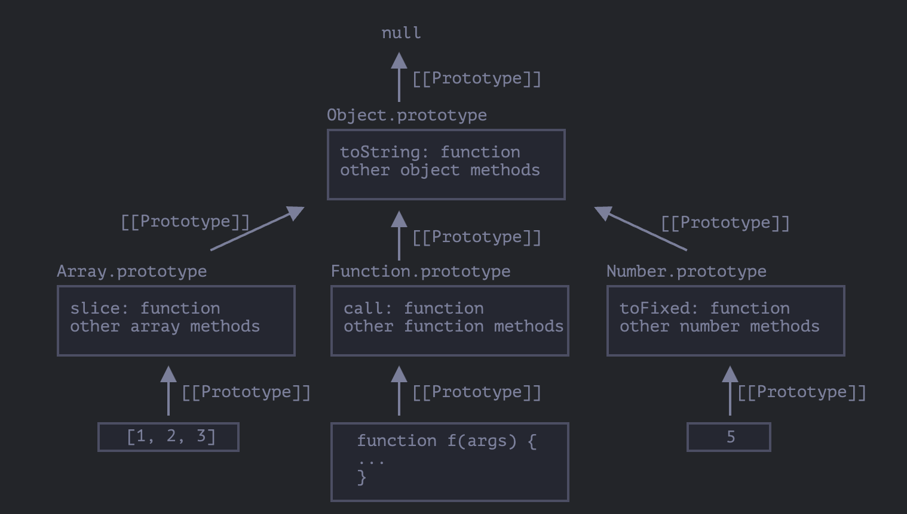

# Встроенные прототипы

```jsx
let obj = {};
alert( obj ); // "[object Object]" ?
```

Код, который генерирует строку `"[object Object]"` - это встроенный метод `toString`, который есть в прототипе `Object.prototype`

Краткая нотация `obj = {}` – это то же самое, что и `obj = new Object()`

```jsx
let obj = {};
console.log(obj.__proto__ === Object.prototype); // true
// obj.toString === obj.__proto__.toString === Object.prototype.toString // true
```

***Другие встроенные объекты, такие как `Array`, `Date`, `Function` и другие, также хранят свои методы в прототипах.***



```jsx
let arr = [1, 2, 3];

// наследует от Array.prototype
alert( arr.__proto__ === Array.prototype ); // true

// затем наследует от Object.prototype
alert( arr.__proto__.__proto__ === Object.prototype ); // true

// и null на вершине иерархии
alert( arr.__proto__.__proto__.__proto__ ); // null
```

Некоторые методы в прототипах могут пересекаться, например, у `Array.prototype` есть свой метод `toString`, который выводит элементы массива через запятую:

 

```jsx
let arr = [1, 2, 3]
alert(arr); // 1,2,3  <-- результат Array.prototype.toString
```

Но так как `Array.prototype` ближе в цепочке прототипов, то берётся именно вариант для массивов:

### Изменение встроенных прототипов

Встроенные прототипы можно изменять. Например, если добавить метод к `String.prototype`, метод становится доступен для всех строк:

```jsx
String.prototype.show = function() {
  console.log(this);
};
"BOOM!".show(); // BOOM!
```

***Прототипы глобальны, поэтому очень легко могут возникнуть конфликты. В итоге одна реализация перезапишет другую.***

***Изменение встроенных прототипов считается плохой идеей.***

**В современном программировании есть только один случай, в котором одобряется изменение встроенных прототипов. Это создание полифилов.**

Полифил – это термин, который означает эмуляцию метода, который существует в спецификации JavaScript, но ещё не поддерживается текущим движком JavaScript.

```jsx
if (!String.prototype.repeat) { // Если такого метода нет
  // добавляем его в прототип

  String.prototype.repeat = function(n) {
    // повторить строку n раз

    // на самом деле код должен быть немного более сложным
    // (полный алгоритм можно найти в спецификации)
    // но даже неполный полифил зачастую достаточно хорош для использования
    return new Array(n + 1).join(this);
  };
}

alert( "La".repeat(3) ); // LaLaLa
```

Пример:

```jsx
Function.prototype.defer = function(ms) {
  let f = this;
  return function(...args) {
    setTimeout(() => f.apply(this, args), ms);
  }
};

// check it
function f(a, b) {
  alert( a + b );
}

f.defer(1000)(1, 2); // выведет 3 через 1 секунду.
```