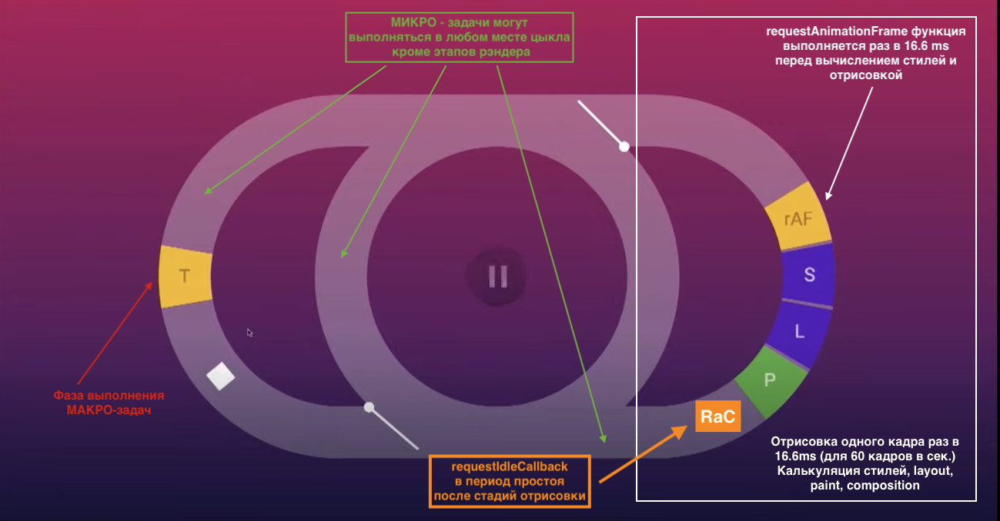

# Event Loop

**Event Loop - специальный механизм позволяющий использовать неблокирующую модель ввода вывода данных.** 

**Никак напрямую не связан с JavaScript, предоставляется средой выполнения кода.
Другими словами механизм позволяющий выполнять неблокирующие асинхронные операции в синхронном однопоточном JS.**



**В браузере за часть реализации Event Loop отвечает браузерный движок:**

- стек вызовов
- куча

**Остальные состовляющие выполняет Web API:**

- очередь микрозадач ( очередь задач )
- очередь макротасок ( очередь событий )
- requestAnimationFrame / requestIdleCallback

**Основные состовляющие Event Loop в браузере:**

- **call stack** основной поток синхронного года (Движок JS)
- **очередь микрозадач** (Web Api)
- **очередь макрозадач** (Web Api)
- **requestAnimationFrame** (Web Api) выполняется раз в кадр (16.6 ms) перед новой отрисовкой, *обычно для анимаций*
- **requestIdleCallback** (Web Api ?? )  позволяет выполнять низкоприоритетные операции в период простоя браузера (обычно, это происходит после вычисления браузером макета и его перерисовки, когда осталось какое-то время перед синхронизацией).

**Последовательность выполнения потока кода:**

1. Выполняется синхронный код call stack / main thread
2. Выполняются все микрозадачи.
3. Выполняется одна макрозадача, одна !!!
4. Проверяется наличие синхронного кода (обычно его нет ?? а мож и есть х.з. ), проверяется очередь микрозадач (если они есть - все выполняются)
5. Выполняется следующая макрозадача.
6. Цикл повторяется.

**Блокировка пользовательского интерфейса:**

- **рекурсивный вызов без базового случая микротаски самой себя в очереди микрозадач или функции в синхронном коде  - блокируют EventLoop, браузер и пользовательский интерфейс. 
Так как в очереди макрозадач после выполнения первой - следует проверка на наличие более приоритетных задач - браузер не блокируется…..**
- **С Макро задачами и колбеками переданными в requestAnimationFrame такого не будет - не блокируют пользовательский интерфейс.**

**Задачи для очереди микротасок:**

- promise
- async functions (так как вернут promise)
- queueMicrotask
- mutationObserver (следит за манипуляциями с нодами DOM дерева)

**Задачи для очереди макротасок:**

- слушатели событий ( click, onChange )
- таймеры / интервалы

**setTimeout с задержкой 0 ~ 15 сек будет как правило выполнятся перед функцией переданной в requestAnimationFrame!!!**

### Бесконечные рекурсивные вызовы микро и макро тасок + requestAnimationFrame

```jsx
// !!! полностью заблочит пользовательский интерфейс так как микрозадачи
const f = () => {
	console.log('--  f -->');
	return Promise.resolve().then(f)
}
f()

---------------------------------

// полетит куча последывательных вызовов 
// но пользовательский интерфейс не заблокируется - все будет кликабельно
 const f = () => {
 	console.log('--  f -->');
 	setTimeout(f)
 }
 f()
 
// c requestAnimationFrame также интерфейс не заблокируется
// колбэк requestAnimationFrame выполняется 1 раз в 16.6 ms
const f = () => {
 	console.log('--  f -->');
 	requestAnimationFrame(f)
}
f()
```

```jsx
// Жопный маневр с requestAnimationFrame
console.log(1)

setTimeout(function(){
	console.log(2);
	Promise.resolve().then(() => console.log(3))
}, 0);

Promise.resolve().then(function() {
	console.log(4);
	setTimeout(() => console.log(5),0);
})

requestAnimationFrame(function() {
	console.log(7);
});

console.log(6);

// 1, 6, 4, 2, 3, 5, 7

// requestAnimationFrame можно представить как ->
// setTimeout(() => ... , 1000 / 60); позжу чем setTimeout(() => , 0)
```

```jsx
// топчик для понимания
console.log('start');

const promise1 = Promise.resolve().then(() => {
  console.log('promise1');
const timer2 = setTimeout(() => {
    console.log('timer2')
  }, 0)
});

const timer1 = setTimeout(() => {
  console.log('timer1')
const promise2 = Promise.resolve().then(() => {
    console.log('promise2')
  })
}, 0)

console.log('end');

// start end promise1 timer1 promise2 timer2
```

```jsx
// Подьёбка резолв промиса внутри setTimeout 
const promise = new Promise((resolve, reject) => {
  console.log(1);
  setTimeout(() => {
    console.log("timerStart");
    resolve("success");
    console.log("timerEnd");
  }, 0);
  console.log(2);
});

promise.then((res) => {
  console.log(res);
});

console.log(4);

// 1 2 4 timerStart timerEnd success
```

```jsx
// спрятано в вызове функции
console.log('start')

const fn = () => (new Promise((resolve, reject) => {
  console.log(1);
  resolve('success')
}))

console.log('middle')

fn().then(res => {
  console.log(res)
})

console.log('end');

// start middle 1 end success
```

```jsx
const timer1 = setTimeout(() => {
  console.log('timer1');

const promise1 = Promise.resolve().then(() => {
    console.log('promise1')
  })
}, 0)

const timer2 = setTimeout(() => {
  console.log('timer2')
}, 0)

// timer1 promise1 timer2
```
