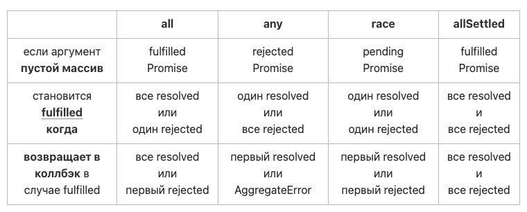

# Promise Статичные методы

**Promise.resolve** - сразу резолвится переданным значением

**Promise.reject** - сразу реджектится переданным значением

**Ниже все методы принимают Array<Promises> и возвращают НОВЫЙ Promise !!!**

При передаче пустого массива:

- **Promise.all -** вернется Promise c []
- **Promise.allSettled -** вернется Promise c []
- **Promise.race -** зависнет в состоянии ‘panding’ !!!
- **Promise.any** - вернётся ошибка !!!

**Promise.all** - нужны все выполненные (все или ошибка первого)

- дожидаемся пока все промисы из `array` будут выполнены, в `onFulfilled` мы получаем массив результатов в том же порядке в каком были установлены промисы в начальном массиве;
- в случае если хоть один промис из `array` будет отклонён, в `onRejected` мы получим причину первого отклоненного промиса.

**Promise.allSettled** -дождётся выполнения всех обещаний и вернёт массив специальных объектов: `{ status: 'fulfilled', value: 66 }`
либо  `{ status: 'rejected', reason: Error: an error }`

**Promise.race** - **любое певрое:**  первое значение или первый отказ:

- дожидаемся когда любой промис из `array` выполнится или отклонится, в `onFulfilled` мы получим результат первого такого промиса.

**Promise.any** - первое успешное значение или массив с причинами отказа

- дожидаемся когда хотя бы один промис из `array` выполнится, в `onFulfilled` мы получаем результат первого выполненного промиса;
- в случае если все промисы из `array` будут отклонены,  вернется объект “obj” с ключами” : obj.message / obj.errors ( массив с причинами отказа )



**Promise.all**

```jsx
const p1 =  Promise.resolve(33);
const p2 =  new Promise((resolve) => setTimeout(() => resolve(66), 0));
const p3 = 99;  // обычное число

Promise.all([p1, p2, p3]).then((values) => console.log(values));

// [33, 66, 99]
```

**Promise.allSettled**

```jsx
const p1 =  Promise.resolve(33);
const p2 =  new Promise((resolve) => setTimeout(() => resolve(66), 0));
const p3 = 99;  // обычное число
const p4 = Promise.reject(new Error("an error"));

Promise.allSettled([p1, p2, p3, p4]).then((values) => console.log(values));

// [
//   { status: 'fulfilled', value: 33 },
//   { status: 'fulfilled', value: 66 },
//   { status: 'fulfilled', value: 99 },
//   { status: 'rejected', reason: Error: an error }
// ]
```

**Promise.race**

```jsx
const p1 =  Promise.reject("Some error");
const p2 =  new Promise((resolve) => setTimeout(() => resolve(66), 0));
const p3 = 99;
const p4 = Promise.resolve(33);

Promise.race([p1, p2, p3, p4])
	.then((values) => console.log(values))
	.catch((err) => console.log(err)) <---
	// Some error
	
	Promise.race([p2, p3, p4]) // ** убрали ошибочный промис
	.then((values) => console.log(values))
	// 99
```

**Promise.any**

```jsx
const p1 =  Promise.reject("Some error");
const p2 =  new Promise((resolve) => setTimeout(() => resolve(66), 0));
const p3 = 99;
const p4 = Promise.resolve(33);

Promise.any([p1, p2 ,p3, p4]) // ** есть ошибочный промис
	.then((values) => console.log(values)) <---
	// игнорируем ошибочные и ждем первый выполненный - p3 = 99 !!!
	.catch((err) => console.log(err)) 
	// 99
	
const p1 =  Promise.reject("Some error");
const p2 =  Promise.reject("Some error 2");

Promise.any([p1, p2]) // ** все ошибочные
	.then((values) => console.log(values)) // мимо
	.catch((err) => {
		console.log(err.message) // All promises were rejected
		console.log(err.errors) // ['Some error', 'Some error 2']
	})
```