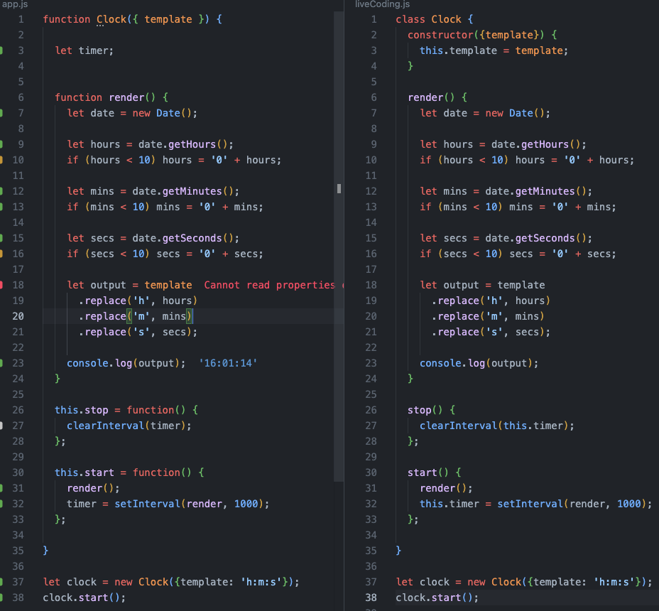

# class - базовый синтаксис

*Класс – это базовый расширяемый шаблон кода для создания объектов, который устанавливает в них начальные значения (свойства) и реализацию поведения (методы).*

```jsx
class User {
  constructor(name) {
    this.name = name;
  }
  sayHi() {
    console.log(this.name);
  }

}
// Использование:
let user = new User("Иван");
user.sayHi();
console.log(typeof User); // function
```

Отличия от функции конструктора:

- функция, созданная с помощью `class`, помечена специальным внутренним свойством `[[IsClassConstructor]]: true`.
- у классов нет хостинга, как у function declaration
- тело класса всегда выполняется в strict mode режиме
- В отличие от обычных функций, конструктор класса не может быть вызван без `new`
- Методы класса являются неперечислимыми. `enumerable` в `false` для всех методов в `"prototype"`.



### Конструкция class User {...} делает:

- Создаёт функцию с именем `User`, которая становится результатом объявления класса. Код функции берётся из метода `constructor`
- Сохраняет все методы, описанные в классе, в `User.prototype`

### Использование Геттеров / Сеттеров

```jsx
class User {
  constructor(name) {
    // вызывает сеттер
    this.name = name;
  }

  get name() {
    return this._name;
  }

  set name(value) {
    if (value.length < 4) {
      alert("Имя слишком короткое.");
      return;
    }
    this._name = value;
  }

}

let user = new User("Иван");
alert(user.name); // Иван

user = new User(""); // Имя слишком короткое.
```

При объявлении классов:

- методы записываются в “User” .prototype
- геттеры и сеттеры также  записываются в “User” .prototype
- свойства НЕ УСТАНАВЛИВАЮТСЯ В prototype, они создаются оператором `new` перед запуском конструктора, это именно свойства объекта.