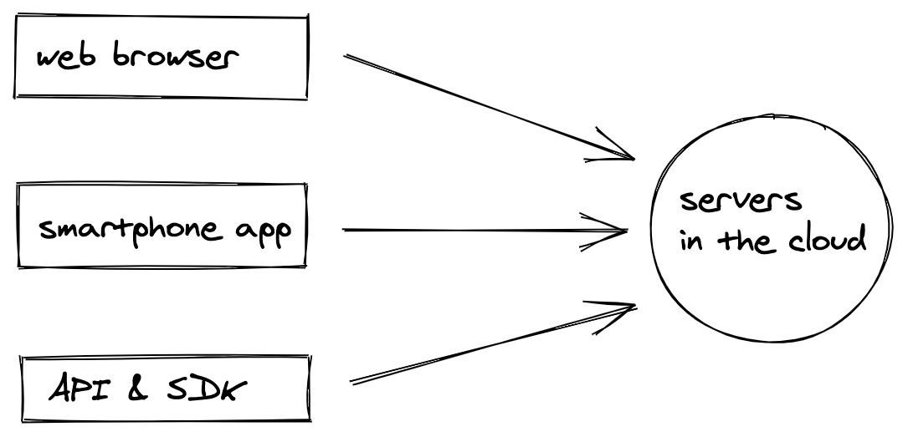
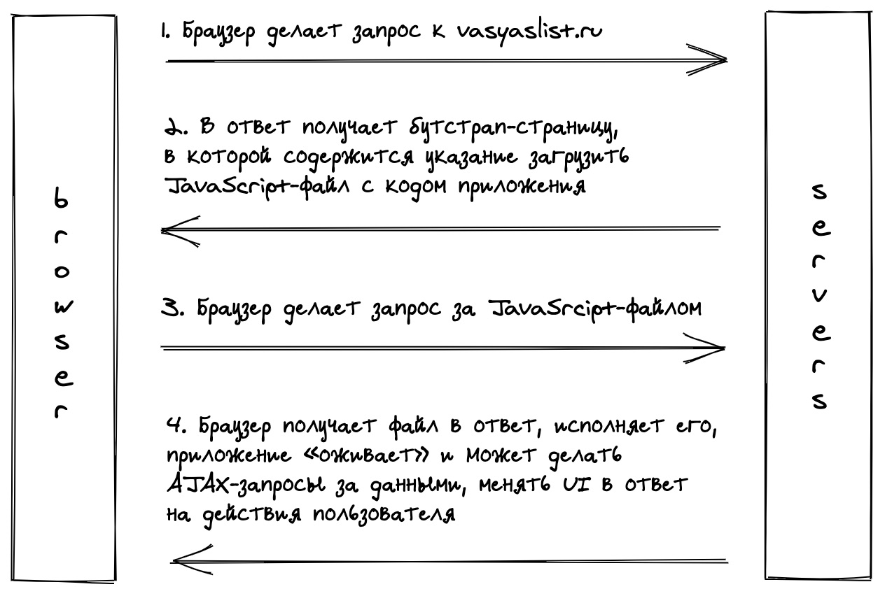
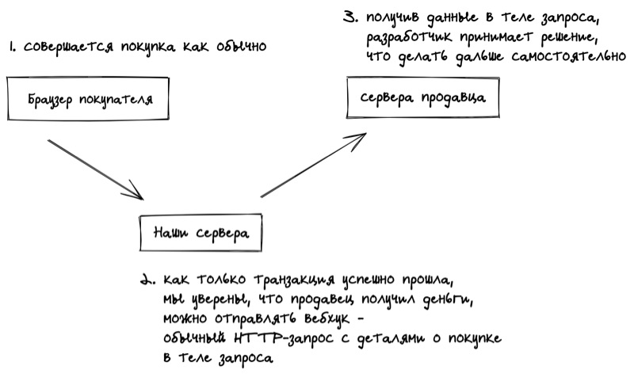
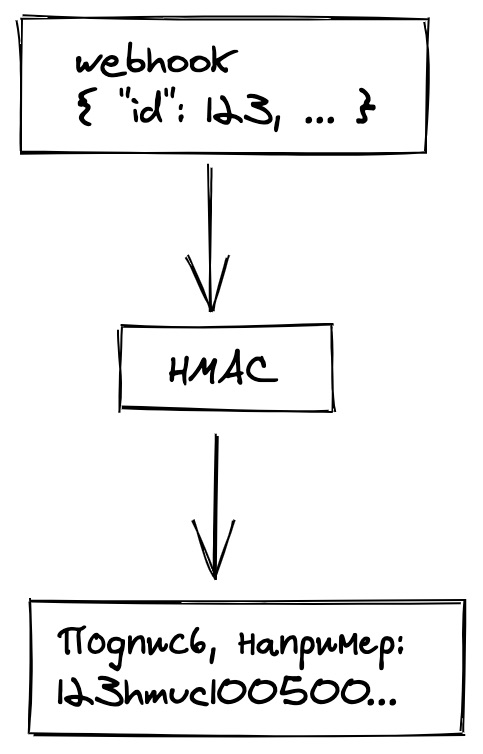
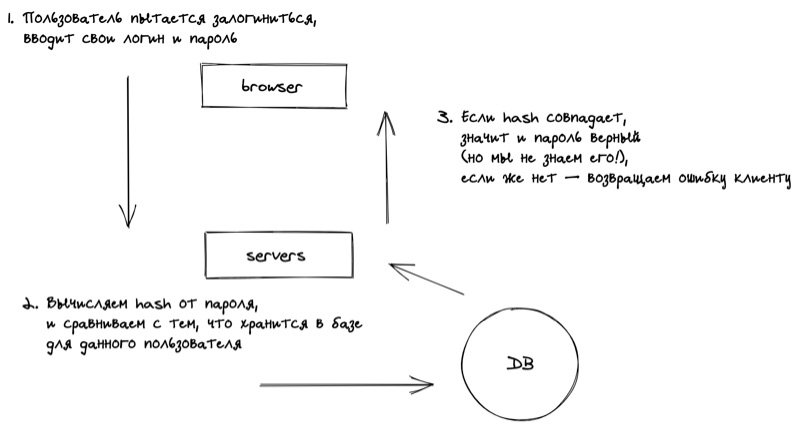
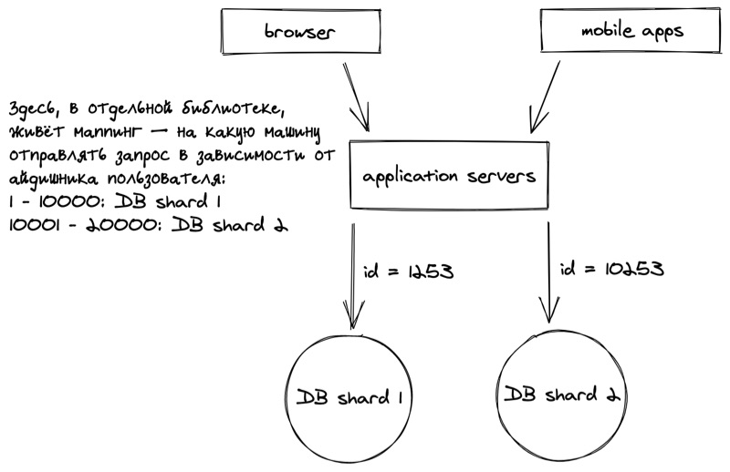
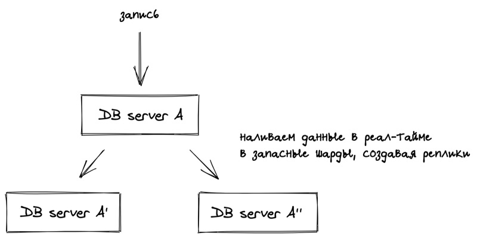
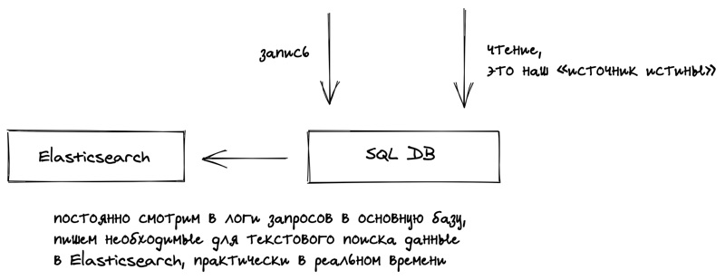
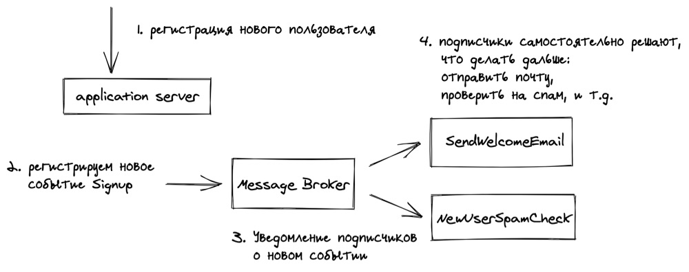

System Design для самых маленьких
=================================

Введение [#](#введение)
-----------------------

Собрались вы как-то с другом детства Василием и решили создать стартап. Василий предлагает оригинальную идею: «а давай сделаем русский Craigslist, будет Vasyaslist?». Идея отличная, свежая. Вам нравится. Василий будет CEO, а вы — CTO.

Ваша задача — спроектировать всю платформу с технической точки зрения. У вас есть маркерная доска, кофе и пару часов времени. Во-первых, надо понять что из себя будет представлять эта «платформа», а так же спланировать её развитие на 5 лет и понять какие нужны будут для этого ресурсы.

Вы делаете глубокий вдох, и начинаете свой рассказ. Василий внимательно слушает.

С высоты птичьего полёта [#](#с-высоты-птичьего-полёта)
-------------------------------------------------------

«Вообще говоря, система представляет из себя клиент-серверное взаимодействие», — начинаете вы свой рассказ. Василий хмурит брови.

Проще надо быть, берём в руки маркер.

У нас есть сервера, на которых происходит вся магия. Есть набор клиентов, которые делают HTTP-запросы на определённые URL-адреса. Запросы эти приходят на наши сервера, читай компьютеры, заставляют их что-то делать и отправлять ответы назад клиентам. Обычно в ответах какие-то данные: будь то JSON или целиком HTML-страница.

Разберёмся что за клиенты у нас есть:

*   одностраничное веб-приложение, работающее в браузере;
*   мобильное приложение, работающее на смартфонах (даже несколько приложений, под разные платформы);
*   API и SDK, которые мы даём сторонним разработчикам, чтобы автоматизировать взаимодействие с нашей платформой.

Зачем нужно API? Скажем, крупные продавцы хотят автоматически создавать каталоги своей продукции, без необходимости часами ковыряться в интерфейсе, добавляя товары вручную.

Чуть позже обсудим мобильные приложения и SDK, но сперва сформулируем о какой «серверной магии» дальше пойдёт речь:

*   вебхуки;
*   аутентификация;
*   база данных;
*   полнотекстовый поиск;
*   админ-панель;
*   регулярные таски (cron);
*   pubsub;
*   аналитика.

Веб-приложение [#](#веб-приложение)
-----------------------------------

Одностраничное приложение, или SPA, работающее в браузере — наш главный продукт. Василий недоверчиво смотрит на вас при слове «одностраничный». Нет, конечно, у нас будет много страниц, а не одна. Надо пояснить.

С точки зрения браузера мы будем загружать одну HTML-страницу, т.н. «бутстрап», которая содержит в себе JavaScript-файл с кодом приложения. После загрузки браузером этого файла — приложение «оживает». Далее, пользователь совершает какие-то действия, а мы делаем AJAX-запросы без перезагрузки страницы, получаем в ответ данные, и обновляем интерфейс.

Приложения для смартфонов [#](#приложения-для-смартфонов)
---------------------------------------------------------

Мы делаем два приложения, для Android и iOS. По своей сути они похожи на одностраничное приложение: предоставляют UI пользователю, при взаимодействии с которым происходят HTTP-запросы к нашим серверам, UI меняется в зависимости от ответов.

Так как мобильные приложения должны предоставлять ровно тот же самый набор фич, который есть в веб-приложении, логично сделать единый API.

Что ещё за API? [#](#что-ещё-за-api)
------------------------------------

Это набор URL-адресов, т.н. endpoints («ручка»), обращаясь к которым можно получить данные (скажем, список товаров) или поменять состояние на сервере (добавить новый товар).

API будем пользоваться не только мы для разработки наших приложений. Пользователи должны иметь возможность автоматизировать работу с нашей платформой. По аналогии с тем, как в соцсетях можно лайкать, читать и писать посты, мы хотим дать возможность искать, покупать и смотреть товары.

Например, чтобы посмотреть список товаров можно обратиться по адресу `vasyaslist.ru/api/v1/listings`, ответ будет в формате `JSON`:

    {
      "listings": [
        {
          "id": 2178123867,
          "name": "TV",
          "country": "RU",
          "city": "Moscow",
          "price_amount": 6000,
          "price_currency": "rub"
        },
        {
          "id": 182312679,
          "name": "Bicycle",
          "country": "RU",
          "city": "Moscow",
          "price_amount": 5000,
          "price_currency": "rub"
        }
      ]
    }
    

> Любопытно, что [иногда добавляют](https://developer.twitter.com/en/docs/basics/twitter-ids) айдишник как строку. Это делается специально для JavaScript, который не умеет работать с числами > 53 бит.

Формат `JSON` очень легко распарсить. Несмотря на то, что `JSON` это _JavaScript Object Notation_, формат не является специфичным для JavaScript, многие языки поддерживают парсинг `JSON` (иногда даже в стандартной библиотеке).

Мы хотим понимать кто пользуется нашим API: скажем, чтобы понять может ли пользователь запрашивать те или иные данные, или какую нагрузку он создаёт на платформу. Для этого мы **выдадем каждому пользователю специальные ключ**, аналог его пароля для доступа к API. Это просто строчка рандомных символов, которые будут указаны на его странице настроек.

В каждом запросе ему необходимо включать эту строчку в тело запроса или в значение специального заголовка `X-VASYASLIST-API-TOKEN`. Принимая каждый запрос к API мы, сравнивая пришедшее значение с теми, что есть в базе, можем понять кто перед нами (если левый пользователь — вернуть `403` код ответа).

Чтобы сделать жизнь пользователей (и нашу при переходе на новую версию API, про это чуть дальше) проще — напишем набор библиотек для популярных языков, которые абстрагирую запросы по HTTP, оборачивая всё в понятный интерфейс. Таким образом, и пользователям проще будет писать свои приложения, и нам поменять URL-адреса, в случае необходимости.

Пример для Node.js:

    const api = new VasyasListSDK({ API_KEY: '...' });
    
    api.getListings({ country: 'RU' }).then(res => {
        // { "listings": [...] }
        console.log(res);
    });
    

Кстати, обратите внимание на `v1` в URL-адресе `/api/v1/listings`. Если вдруг мы захотим поменять формат ответа несовместимым образом, мы просто создадим новый endpoint `/api/v2/listings`. При этом первая версия должна остаться рабочей, ведь какое-то количество клиентов уже пользуется ей.

Однако, если все пользуются написанными нами SDK изначально, то переход на новую версию API не означает изменения в публичном интерфейсе SDK, т.е. для пользователей это будет выглядеть как просто поставить новую _минорную_ версию библиотеки и всё работает само.

Вебхуки [#](#вебхуки)
---------------------

Итак, некоторые крупные продавцы пользуются нашим API.

Возникает **желание реагировать на некоторые события** на платформе, желательно сразу как только событие случилось. Скажем, продавец хочет отправить письмо покупателю, а так же запрос на свой склад, чтобы оформили доставку. Как понять, что человек сделал покупку?

Есть вариант раз в определённый интервал времени обращаться к API, спрашивая «Купили этот товар? Нет. А сейчас?» (это называется long polling). Понятно, что при таком подходе нагрузка на нашу платформу будет значительно больше, чем могла бы.

Лучше сделать наоборот. Что если разработчики зарегистрируют на странице настроек свои URL-адреса, по которым будем обращаться _мы_ каждый раз когда произошло событие, передавая в привычном уже формате `JSON` айдишник товара, цену, айдишник покупателя, его адрес, и т.д.

Получив такой запрос, где-то на своём сервере, продавец сможет принять нужные решения и отреагировать как угодно (отправить письмо, отправить запрос на склад, и т.д.)

### Какие есть проблемы с вебхуками? [#](#какие-есть-проблемы-с-вебхуками)

Каким образом понять, что вебхук действительно пришёл при наступлении определённого события на платформе? Никто не мешает сформировать HTTP-запрос, в теле указав подтверждение оплаты, самый дорогой телевизор, и свой айдишник покупателя, отправить на указанный адрес и вот уже на складе оформляют доставку.

URL-адрес вебхука продавца **публично доступен в интернете**, не находится за VPN, иначе бы мы сами не смогли отправить на него запрос.

Но ведь адрес никто не знает кроме продавца, который указывает его на странице настроек, и нас, верно? Это плохая стратегия (security by obscurity). Стоит ли говорить, что трафик в интернете можно прослушать и всё тайное станет явным.

Необходимо верифицировать наш запрос, делается это с помощью **криптографической подписи**.

### Электронная подпись [#](#электронная-подпись)

Итак, как же подписать запрос? Когда продавец регистрирует свой вебхук на странице настроек, генерируется специальная строчка рандомных символов, т.н. «приватный ключ». Он пригодится и нам и ему. Сейчас поясню как.

Вы же знаете, что такое шифрование, Энигма, вот это всё?

Можно взять тело запроса и зашифровать с помощью одного из алгоритмов шифрования, например HMAC, с использованием нашего приватного ключа. На выходе получаем строчку рандомных символов, которую включим в специальный заголовок.

На той стороне берут тело запроса и проделывают ровно то же упражнение. Приватный ключ один и тот же, и результат получается тот же — остаётся только сравнить с тем, что пришло в значении заголовка и убедиться, что всё верно.

Зная только URL-адрес не получится подделать запрос.

### Доступность [#](#доступность)

Другая проблема — доступность сервера, куда отправляем наш запрос. Что если не удаётся установить соединение? А что если запрос просто висит? Что если получили HTTP-код ответа 500?

Можно выбрать разные стратегии. Например, «убедимся, что достучались хотя бы один раз». Это значит, что будем пытаться отправить вебхук пока не получим 200, с экспоненциальным затуханием по времени между попытками.

Что если предыдущий запрос, который отвалился по таймауту, на самом деле был обработан (просто ответ не получили)? В таком случае **вебхук будет отправлен дважды**. Надо явно об этом предупредить пользователей API, это их задача правильно обработать такие ситуации и не отправить клиенту два телевизора вместо одного.

Итак, с вебхуками всё. Поговорим про аутентификацию.

Аутентификация [#](#аутентификация)
-----------------------------------

Пользователи нашего приложения должны иметь возможность залогиниться в сервис по паролю. Есть и другие способы, например, OAuth, но сейчас обсудим традиционный способ.

Основная проблема — хранение паролей. Проблема в том, что **в открытом виде пароли хранить нельзя**.

Есть очень много историй как та или иная компания торчала голой монгой наружу допускала утечку данных, в итоге, пароли оказывались в интернете в открытом доступе. Учитывая, что многие пользователи продолжают использовать одинаковые пароли на разных сервисах — всё очень плохо.

Есть отличный способ, который позволяет избежать хранения паролей в базе — **хэширование**.

> Хэш-функция берёт исходный пароль и возвращает случайный набор символов определённой длины. Хорошая хэш-функция практически не даёт коллизий (в теории их не избежать).

Особенность хэширование в том, что очень легко решить прямую задачу, т.е. получить сам хэш, но почти невозможно обратную, т.е. по хэшу получить исходный текст. Это как раз то, что нужно!

Такие данные бесполезны для потенциальных злоумышленников.

База данных [#](#база-данных)
-----------------------------

Будем хранить данные в реляционной базе, например, MySQL. Вне сомнений у нас будет очень успешный стартап, поэтому и данных за 5 лет накопится много.

Что из себя представляет база данных? Это просто программа, которая работает на компьютере: хранит данные на диске, потребляет оперативную память. С ростом объёма данных, очевидно, что на одну, даже самую мощную машину, данные перестанут помещаться. Запросы к базе начнут тормозить.

Рано или поздно придётся делать **шардинг** — разделение единой базы данных на несколько компьютеров.

Шардирование [#](#шардирование)
-------------------------------

Что значит «разделить базу данных на несколько компьютеров»? По сути, придётся запустить несколько независимых баз данных на разных компьютерах, т.н. **кластер**, и разделить данные по ним.

Встаёт интересный вопрос: как именно делить данные? Как угодно. В нашем случае, большинство запросов будет относиться к конкретному пользователю, соответственно, и таблички с данными для него должны быть рядом.

Можно шардировать по пользователю, условно с 1-10000 хранятся на машине A, с 10001-20000 на машине B. Можно всех чётных на одну машину, всех нечётных — на другую. Какие здесь есть проблемы?

Скажем, а что если у пользователя 500 гигантский список товаров, такой что можно и отдельную машину выделить под него? Если такое случится — придётся создать исключение для конкретного айдишника пользователя.

Появляется специальный сервис, перед базами данных, который будет отвечать за роутинг, т.е. **маппинг между айдишниками пользователей и адресами машин** куда слать запросы.

Удобно выделить это в отдельный сервис, чтобы логика была в одном месте и можно было подкрутить маппинг в случае необходимости. Можно и в отдельную библиотеку, которую использовать на фронт-серверах, ради уменьшения количества запросов (и повышения отказоустойчивости).

> фронт-сервера, или application servers — там где крутится логика по обработке запросов от клиентов и построении ответов. Здесь происходит отправка запросов в базу данных, очереди и другие веб-сервисы, которые недоступны из интернета, не имеют публичного API, и общаются только с этими самыми фронт-серверами.

Рассмотрим вариант с остатком от деления: номер шарда вычисляет как остаток от деления айдишника пользователя на количество машин.

Допустим у нас две машины в кластере. Всё идёт хорошо, но в какой-то момент этого станет мало. Добавим третью машину, но каким образом мигрировать данные без простоя всей системы? На данном этапе система уже работает круглосуточно и пользователи не обрадуются увидев «ведутся технические работы» вместо привычного интерфейса.

Допустим, мы решаем разбить вторую машину на две. Можно поступить следующим образом:

*   заводим третью машину и настраиваем роутинг так, что запись начинается на обе машины сразу;
*   вторая машина продолжает работать на чтение;
*   наливаем на третью машину все данные со второй;
*   переключаем роутинг на третью машину, смотрим в логи и метрики какое-то время, пока не убедимся, что для пользователей ничего не поменялось, в случае чего переключаемся назад и смотрим где мы ошиблись на предыдущем шаге.

Когда у нас есть две идентичные копии удаляем «лишних» пользователей: на второй машине удаляется каждый третий пользователь, а на третьей — каждый второй.

При небходимости повторяем упражнение и для первой машины, если база распухла.

При копировании данных важно не положить базу дополнительными запросами: следим за нагрузкой, ограничиваем количество запросов при необходимости.

> Некоторые базы данных умеют шардирование из коробки, занимаясь такими манипуляциями под капотом.

Реплицирование [#](#реплицирование)
-----------------------------------

Все же знают истории компаний, который закрывались после полной потери всех данных пользователей? Диски выходят из строя, компьютеры сгорают. На этот случай нужна полная копия всей базы.

Т.к. запись происходит круглосуточно, то и реплицировать необходимо в реальном времени.

Если вдруг один из шардов выходит из строя, мы выкатываем хотфикс библиотеки роутинга (или пишем автоматическое переключение когда шард не отвечает, на уровне библиотеки) и вот уже запросы пошли на запасные шарды.

Кроме того, есть дополнительный бонус. Если возникает много запросов на чтение у нас есть копии шардов куда можно пустить запросы, распределив тем самым нагрузку.

Важно понимать, что реплицирование это не то же самое, что бекапы. Последние происходят по расписанию и **хранятся отдельно**. Бекапы нужны на случай если произойдёт что-то совсем страшное и сгорит весь дата-центр. В таком случае можно будет восстановить всю базу на момент последнего бекапа, потеряв совсем немного данных (лучше чем закрыть компанию целиком).

Какие есть проблемы с реплицированием?

**Рассинхронизация**. Во-первых, копирование происходит не мгновенно, во-вторых, какие-то запросы могут завершиться неудачно и данных не окажется на реплике.

Нужно понимать в каких случаях это допустимо, а в каких критично. Скажем, если разные пользователи увидят разное количество лайков — это ничего, они даже об этом не узнают. Однако, если пользователи увидят неправильное количество денег после перевода — это критично, сразу начнутся звонки в поддержку посреди ночи.

На помощь приходит **синхронный вариант реплицирования**.

В асинхронном варианте запрос на запись в базу завершается успешно не дождавшись записи в реплики. Таким образом клиенты, в итоге, получат ответ быстрее. Однако, очередной запрос на чтение может выдать неверный результат (если придёт в реплику раньше, чем там окажется запись).

В синхронном варианте запрос на запись в базу будет висеть пока не нальются все реплики, и если какой-то из запросов на запись завершился неуспешно, под капотом будет ретрай, и мы будем ждать. Это очевидно может увеличить время ответа, зато гарантируется консистентность данных.

Полнотекстовый поиск [#](#полнотекстовый-поиск)
-----------------------------------------------

Одна из главный фич нашего сайта — поиск на нормальном человеческом языке. SQL отлично справляется только со структурированными запросами, скажем если бы у нас был фильтры по списку товаров.

Нужна другая база данных, которая заточена специально под такой поиск — **Elasticsearch**. Это документо-ориентированная база данных, которая кроме самого поиска умеет «правильно» ранжировать результаты запроса, т.е. по некоторой оценке «близости к исходному запросу», а не просто по алфавиту или как-то ещё бесполезно для пользователя.

Можно подумать «Отлично, так Elasticsearch лучше SQL-базы, может там будем всё хранить?» Не совсем. Везде есть свои плюсы и минусы. Elasticsearch медленнее работает на запись, менее надежён в смысле потери данных.

Выход — использовать две базы сразу. Elasticsearch для поиска, там где он хорошо справляется, а для всего остального SQL. Будем в фоне копировать данные из нашей основной базы, источника истины, в Elasticsearch.

Чтобы меньше грузить основную базу можно наливать данные не в реальном времени, а по расписанию. Поиск не настолько важная штука.

Кстати, на реальном Craigslist после загрузки своего списка товаров появляется предупреждение «Ваш список будет доступен в поиске в течении 15 минут». Как раз по этой причине — копирование из основной базы. Вполне допустимый компромисс.

Что будет если какие-то записи потеряются? Ничего страшного. Происходит это не слишком часто и не так критично, если бы они терялись в основной базе.

Админ-панель [#](#админ-панель)
-------------------------------

На сайте где пользователи постоянно генерят контент много администраторской работы: модерация списков товаров (не хотим чтобы через нас продавали оружие), возврат средств, доступ к закрытым данным пользователей для помощи в техподдержке, и т.д.

Каким образом будет устроена такая панель администратора?

Можно просто сделать условных суперюзеров, с флагом `is_super_user`, в основной базе с пользователями. В зависимости от флага показывать в основном интерфейсе дополнительные возможности.

Можно, но опасно. Любая ошибка (например, сотрудник уволился, а флажок мы у него забыли удалить) и все супер возможности откроются не тому пользователю.

Хорошее решение — отдельный сервис, который живёт на специальных серверах, **за VPN**, т.е. в админ-панель нельзя залогиниться просто из интернета. Нужны доступы к основной базе данных? Надо настраивать отдельно, по умолчанию не заработает. Есть дополнительные сложности с разделением на разные машины, но зато надежнее.

> В Яндексе нужно «заказывать доступы» явным образом от одного внутреннего сервиса к другому. Таким образом, даже если взломают какой-то сервис, то ущерб будет минимизирован.

Регулярные таски [#](#регулярные-таски)
---------------------------------------

Есть ряд задач, которые хотим выполнять по расписанию:

*   отправлять отчёты по почте раз в неделю;
*   отправлять маркетинговые письма пользователям;
*   списывать деньги с кредитных карт за подписку раз в месяц;
*   наливать данные в Elasticsearch.

Не хотелось бы ставить себе напоминание «разослать маректинговые письма» и дёргать скрипт руками. **Запускать программы по расписанию можно с помощью cron**.

Выражение «запускать по крону» настолько вошло в обиход, что так называется любой запуск по расписанию, даже если он происходит не с помощью `cron`.

Какие здесь есть проблемы?

Если машина в этом время выключена — ничего работать не будет. Не будет известно какие таски выполнились, а какие нет. В какой-то момент тасок станет настолько много, что одной машины не хватит.

В этот момент можно начать использовать более мощные инструменты, которые умеют решать такие проблемы под капотом, например, **Kubernetes**.

Pubsub [#](#pubsub)
-------------------

Есть ситуации когда мы хотим реагировать определённым образом на какие-то события. Скажем, зарегистрировался новый пользователь — надо отправить ему приветственное письмо, или не удалось списать деньги с карты — надо отправить письмо с угрозами с просьбой её проверить.

Конечно, можно делать это **синхронно**. В момент регистрации отправлять письмо, а пользователь будет в это время на экране регистрации смотреть на крутилку загрузки.

Это плохая идея. С отправкой письма ещё ничего, но в общем случае такие таски могут занимать значительное время и нет никакого смысла заставлять пользователей ждать.

На помощь приходит pubsub. Есть некий **message broker**, который позволяет сервисам подписаться на определённые события, а другим — отправить сообщения, и подписчики их получат.

В самом простом варианте можно завести две таблички в базе: для сообщений и для подписчиков, с отношением многие-ко-многим между записями. Уведомления происходят аналогично вебхукам, описанным ранее: подписчик указывает URL-адрес за который его нужно дёрнуть в нужный момент.

В чём плюсы такого подхода:

*   асинхронность: теперь в фоне может происходит куча всего, не задерживая ответы клиенту;
*   «чистый код» с архитектурной точки зрения: фронт-сервера занимаются исключительно своей логикой;
*   если подписчик не смог выполнить задачу, скажем email-сервер прилёг, он самостоятельно сделает ретрай, т.е. области ответственности разделены между различными сервисами.

Аналитика [#](#аналитика)
-------------------------

Чтобы успешно строить продуктовые гипотезы нужно опираться на данные, понимать, как ведут себя пользователи. Надо дать возможность аналитикам задавать вопросы типа: а сколько списков товаров пользователи создают каждый день, сгруппированные по городам? А сколько новых пользователей создали хотя бы один список товаров в течении месяца?

Чтобы отвечать на такие вопросы нужно прошерстить все шарды, и агрегировать ответ. Писать такие запросы на продакшен-базе — плохая идея. Это создаст значительную нагрузку и замедлит работу самой платформы. SQL хорошо подходит для простых запросов, с построенными для них индексами, которые не будут бежать по всей базе, собирая данные со всех записей.

Когда вся база живёт на одной машине, а единственный аналитик это CEO, условно в первый год жизни сервиса, это вполне нормально.

С ростом количества данных придётся наливать всю базу в специальное **хранилище данных**. История аналогичная копированию в Elasticsearch.

Для этой цели можно использовать **Hive**. Hive даже позволяет писать запросы на языке SQL.

В итоге:

*   SQL база данных — источник истины, а так же служит для обычных запросов «per user» так сказать, раздаёт данные клиентам;
*   Elasticsearch — нужен для полнотекстового поиска;
*   Hive — нужен для «тяжёлых» запросов от аналитиков.
