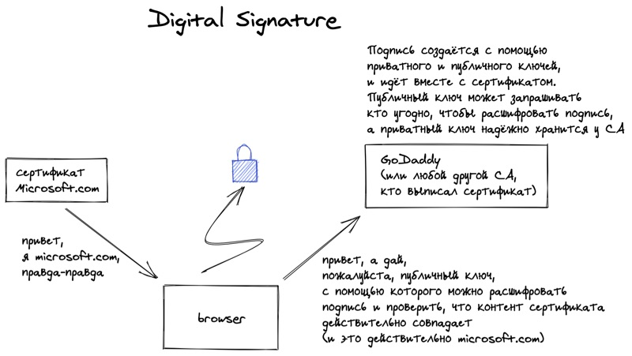
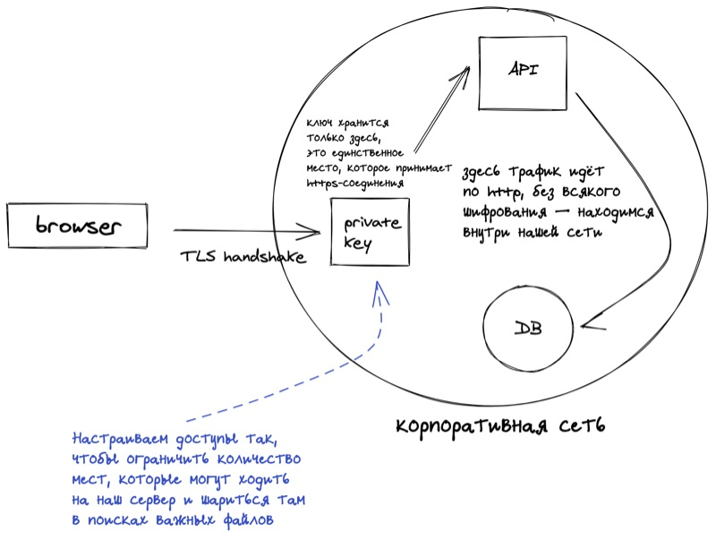
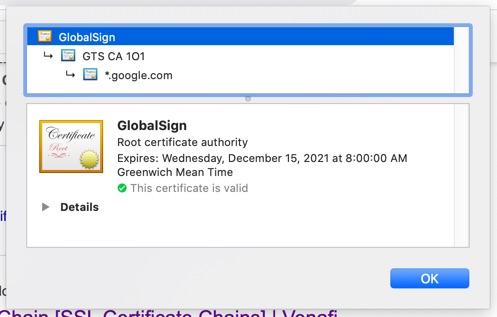
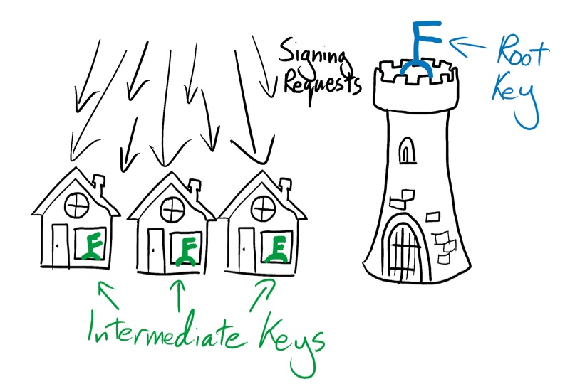

Как работает HTTPS?
===================

HTTPS — это дополнительная надстройка над старым-добрым HTTP, которая повзоляет нам относительно спокойно сидеть в интернете, не опасаясь, что кто-то читает запросы по пути с паролями и данными кредитных карт. Точнее запросы по-прежнему можно читать, но вот понять что там не выйдет. Ну, или почти не выйдет, ведь систем без уязвимостей нет, верно?

Что такое HTTPS?
--------------------------------------

HTTP — правила, по которым могут общаться клиент и сервер. Здесь ничего не меняется. Появляется дополнительный слой шифрования: TLS/SSL или просто SSL. Прежде чем отправить запрос, он шифруется, а по прибытии — расшифровывается.

SSL выполняет две функции:

*   удостовериться, что говорим с нужным сервером;
*   удостовериться, что ничего нельзя прочитать по пути.

Как устанавливается соединение
-------------------------------------------------------------------

Всё начинается с «рукопожатия» (handshake). Его цели:

*   договориться об алгоритме шифрования, который будет использован;
*   договориться о ключе.

Дальше можно шифровать сообщения.

Что? Ключ на этапе хендшейка? Разве нельзя его подменить? Это самое интересное, про это дальше.

Хендшейк состоит из трёх этапов:

*   приветствие;
*   обмен сертификатом;
*   обмен ключом.

На этапе привествия сервер и клиент обмениваются информацией друг о друге. Клиент говорит, что «он умеет», сервер решает какой алгоритм шифрования и версию SSL использовать с учётом того, что клиент умеет.

Теперь, когда соединение установлено, сервер должен подтвердить, что он — это действительно он. Это делается с помощью **сертификата**.

### Обмен ключами [#](#обмен-ключами)

Само шифрование происходит **симметричным образом**, т.е. есть один ключ, о котором договорились на этапе хендшейка. Он используется и клиентом и сервером, чтобы шифровать и расшифровывать сообщения.

Каким же образом безопасно передать этот ключ? Зашифровать его **ассиметричным образом**, т.е. используя публичный ключ **взятый из сертификата**, а сервер расшифрует его с помощью своего приватного ключа, который надежно хранится на сервере и никому больше не известен.

Т.е. перехватить первый запрос-хендшейк и взять ключ оттуда просто бесполезно, потому что это не сам ключ, а зашифрованное сообщение. И все последующие запросы не получится прочитать, потому что этот самый ключ не известен.

Зачем нужно два варианта шифрования? Насколько я понимаю, симметричный вариант проще (и быстрее), поэтому он используется чтобы шифровать и расшифровывать основной массив данных, а ассиметричный вариант используется только один раз для самого синхронного ключа.

### Сертификат [#](#сертификат)

Сертификат похож на паспорт. Содержит информацию о владельце, домен (как бы аналог собственности владельца), публичный ключ, **цифровую подпись** и даты валидности сертификата.

Сертификат это просто текстовый файлик. Тогда кто угодно может составить любой сертификат. Как понять, что он подлинный?

Цифровые подписи — стандартный способ проверить, что контент не был подделан по пути. Аналогичный образом можно, например, [подписывать вебхуки](/posts/what-is-system-design.md#%D0%B2%D0%B5%D0%B1%D1%85%D1%83%D0%BA%D0%B8).

Есть много различных CA (Certificate Authority), которые имеют право выписывать сертификаты, а браузеры знают этот список и знают, где брать публичные ключи (или хранят их сразу в билдах, без походов по сети).

Хозяйке на заметку [#](#хозяйке-на-заметку)
-------------------------------------------

### Публичные wi-fi [#](#публичные-wi-fi)

Может ли злоумышленник читать https-трафик? Становится ясно, что пока у него не будет приватного ключа, который надёжно хранится на сервере, то он не сможет расшифровать симметричный ключ, которым зашифрован основной трафик.

> Всё, что передаётся по http — легко прочитать. Никогда не отправляйте важные данные в формах по http!

Поэтому, кстати, браузер кидает предупреждения про mixed content. Представьте айфрейм, в котором форма грузится по http, внутри https-сайта. Пользователь смотрит на «замочек» и думает, что всё безопасно, а на самом деле сабмиты формы прослушиваются.

### Может ли моя компания мониторить https-трафик? [#](#может-ли-моя-компания-мониторить-https-трафик)

Если есть доступ к компьютеру, то да. Достаточно добавить свой корневой сертификат в браузер, перехватывать все запросы и представляться нужным веб-сайтом, по сути, всё шифруя и расшифровывая по пути (и даже подменяя содержимое запросов). Так как сертификат добавлен в браузер, то никаких проблем с «замочком» нет.

Уязвимости [#](#уязвимости)
---------------------------

### Приватный ключ больше не приватный [#](#приватный-ключ-больше-не-приватный)

Приватный ключ — просто файлик, который хранится у вас на сервере. Каждое TLS-соединение устанавливается с помощью этого файлика, т.е. используется он постоянно. Нельзя использовать его один раз и потом убрать подальше — он должен оставаться на сервере постоянно. А значит, если получить доступ к серверу, то можно и файлик себе стянуть. Всё.

Каким образом защититься от этого?

В принципе, никак, но можно ограничить количество серверов, которые имеют доступ к серверу с приватным ключом.

> Я [моделировал аналогичную историю](/posts/what-is-system-design.md#%D0%B0%D0%B4%D0%BC%D0%B8%D0%BD-%D0%BF%D0%B0%D0%BD%D0%B5%D0%BB%D1%8C) с панелью администратора, которая живёт за VPN.

Вообще, хорошо и правильно настраивать уровни доступа внутри своей корпоративной сети.

Таким образом, если хакер получит доступ к нашей сети, есть вероятность, что на сервер с приватным ключом он добраться не сможет.

Как я уже сказал выше, полностью защититься от кражи ключа невозможно. Что делать, если ключ всё-таки оказался скомпрометирован?

Не существует какого-то единого места, которое можно было бы уведомить, что сертификат невалидный, и все браузеры мгновенно перестали бы ему доверять.

Первая попытка решить эту задачу — т.н. CRL, «список отозванных сертификатов». Браузер скачивает список, проверяет нет ли там сертификата, который он собирается использовать. Это работало, но в какой-то момент эти списки стали настолько огромными, и скачивать их каждый раз стало слишком сложно.

На смену приходит специальный [протокол OCSP](https://en.wikipedia.org/wiki/Online_Certificate_Status_Protocol#:~:text=The%20Online%20Certificate%20Status%20Protocol,on%20the%20Internet%20standards%20track.).

Суть в том, что вместо того, чтобы перекладывать эту ответственность на клиента, она перекладывается на CA — организацию выписавшую сертификат. Там находится база данных отозванных сертификатов.

Как выглядит теперь попытка соединения между `A` (Алиса) и `Б` (Боб):

*   `A` показывает свой сертификат `Б`.
*   `Б` спрашивает CA валиден ли данный сертификат, отправляя серийный номер.
*   CA проверяет номер по своим спискам.
*   Если всё ок, то CA отправляет **подписанный** ответ.
*   `Б` читает ответ, расшифровывая его с помощью публичного ключа, который он получил и сохранил себе заранее.
*   Если всё ок, то `Б` устанавливает соединение с `А`.
*   хендшейк закончен.

Можно ли обмануть браузер, что сертификат не отозван, хотя на самом деле отозван? Для этого теперь нужно украсть приватный ключ у CA, которым подписывается ответ.

Есть ещё одна проблема — что если сервер CA не отвечает? Такое, конечно, может быть. Ничего лучше ретраев пока не придумали 😃.

Какие ещё могут быть уязвимости? Можно отозвать сертификат, только если ты знаешь, что он был скомпрометирован. Однако, вряд ли хакер, который украл приватный ключ, уведомит вас по почте.

### Частая смена сертификатов [#](#частая-смена-сертификатов)

У сертификата есть «срок годности»: это может быть один месяц, а может быть 5 лет.

Желательно не лениться и заказывать сертификат на поменьше, соответственно менять почаще.

Цепочки сертификатов [#](#цепочки-сертификатов)
-----------------------------------------------

В браузерах предустановлено около 60 **корневых сертификатов**, которым браузеры «доверяют по умолчанию». Если приватный ключ утечёт для корневого сертификата — беда, пока не выйдет новая версия браузера с патчем.

Существует **цепочка сертификатов**, когда один CA доверяет другому, тот третьему, и так дело доходит до корневого сертификата. Чтобы провалидировать сертификат для домена, нужно проверить всю цепочку.

[GlobalSign](https://en.wikipedia.org/wiki/GlobalSign) — корневой CA для доменов Гугла.

Так вот, имеет смысл выпускать промежуточные сертификаты, которые в случае утечки приватных ключей проще отозвать. А ключ от корневого сертификата хранить за семью печатями.

Оригинальное изображение из [статьи Роберта](https://robertheaton.com/2018/11/28/https-in-the-real-world/).

Приватный ключ от корневого сертификата хранится на [HSM](https://en.wikipedia.org/wiki/Hardware_security_module) — реальном физическом устройстве, предназначенном для хранения ключей. Это не просто софт. Даже получив доступ к физическому устройству, получить доступ к данным на нём весьма проблематично.

Если промежуточные сертификаты будут скомпрометированы, то можно их отозвать и выпустить новые, подписав корневым сертификатом, таким образом заново встроив в цепочку.

Про CA и корневые сертификаты [#](#про-ca-и-корневые-сертификаты)
-----------------------------------------------------------------

CA, имеющие корневые сертификаты в браузерах, серьёзно обеспокоены своей репутацией. Например, в 2017 году Chrome [выкатили дорожную карту](https://security.googleblog.com/2018/03/distrust-of-symantec-pki-immediate.html) по постепенному отказу от корневого сертификата Symantec начиная с 66 версии, по причине «[утраты доверия](https://security.googleblog.com/2017/09/chromes-plan-to-distrust-symantec.html)», будто бы у Symantec были неоднократные проблемы с безопасностью. За Chrome подтянулись Mozilla и Apple, и Symantec была вынуждена продать всю часть компании про SSL, растеряв всех клиентов.

CA не выдают сертификат, не убедившись, что человек действительно владелец домена. Например, [Let’s Encrypt](https://letsencrypt.org/) просит либо добавить специальную DNS-запись, либо положить файлик на сервер публично доступный по выданному адресу (например, `mysite.com/aDg73fN`).

CTL (Certificate Transparency Logs) [#](#ctl-certificate-transparency-logs)
---------------------------------------------------------------------------

И всё-таки, а как понять, что никто не выписал сертификат для твоего домена? Рано или поздно мошенничество станет очевидно, но может быть поздно.

Гугл популяризировали идею [публично доступных списков сертифатов](https://www.certificate-transparency.org/). Владельцы доменов могут легко посмотреть какие сертификаты были выписаны для определённых доменов, и, если там есть что-то подозрительное, то писать CA с просьбой отозвать левые сертификаты, разобраться.

Есть несколько серверов в Гугле, которые дают доступ к спискам сертификатов. В принципе, кто угодно [может поднять такой сервер при большом желании](https://filippo.io/behindthesofa).

Когда CA выпускает новый сертификат, он должен отправить запись об этом как минимум в два CTL. Те в ответ отправляют подписанные сообщения вида «Я, такой-то CTL, подтверждаю у себя регистрацию сертификата», и подписи добавляются в сам сертификат.

Теперь можно мониторить сертификаты, выпущенные для своего домена. Например, вот [лог для домена vitkarpov.me](https://crt.sh/?q=vitkarpov.me).

Есть и обратная сторона медали наличия таких списков: злоумышленники могут прочёсывать списки всех доменов. Скажем, посмотреть какие сертификаты [выписаны для Фейсбука](https://crt.sh/?q=%25.facebook.com).

Вероятно, какой-нибудь `dewey-lfs.vip.facebook.com` может быть менее надёжно защищен, чем `facebook.com`, и без этих списков не привлёк бы внимания.

Зачем вообще CA отправлять сертификаты в CTL? Ведь это дополнительный шаг, который самим CA как таковым не нужен. Дело в том, что браузеры вынуждают их это делать. Без двух подписей от двух различных CTL браузеры отказывают доверять сертификату.

Любопытно посмотреть, каким образом CTL хранит списки сертификатов. Это не просто текстовый файлик, который можно переписать, проведя изменения задним числом. CTL обязаны хранить списки в виде [деревьев Меркла](https://en.wikipedia.org/wiki/Merkle_tree). Так же работает блокчейн: каждая следующая нода в дереве подписывается хешом от контента её детей, таким образом нельзя просто так взять и поменять что-то в прошлом — получается append only лог.

Если владелец CTL попробует переписать хеши, это не останется незамеченным для организаций, которые проверяют CTL.

Certificate Authority Authorization (CAA) [#](#certificate-authority-authorization-caa)
---------------------------------------------------------------------------------------

Владелец домена может помочь CA сделать процесс безопаснее, ведь и владельцы доменов, и выписывающие сертификаты организации заинтересованы в этом в равной степени.

CAA — [специальная DNS-запись](https://en.wikipedia.org/wiki/DNS_Certification_Authority_Authorization), которую может создать владелец домена. Запись содержит список CA, которые имеют право выписывать сертификаты для домена. Соответственно, CA должен проверить этот список и найти там себя. Конечно, CA могут и не следовать этому правилу — не проверишь. Но в их же интересах снижать вероятность появления новых векторов атак.

> По отчётам [Qualys](https://en.wikipedia.org/wiki/Qualys) на январь 2020 года только 6.8% из 150 тысяч наиболее популярных https-сайтов пользуются CAA.

Так что это уже совсем свежая история. Одним словом, PKI не думает останавливаться в развитии.

В заключение [#](#в-заключение)
-------------------------------

PKI (Public Key Infrastructure) — сложная и интересная система, со всеми этими организациями проверяющими друг друга.

Разработчики Хрома могут легко убить большой бизнес CA при желании, исключив его из корневых сертификатов.

А чего стоит один Hardware Security Module? Когда весь бизнес зависит от безопасности приватного ключа — лучше быть параноиком.

Мир информационной безопасности сложен, но интересен и поэтому прекрасен.

### Материалы [#](#материалы)

*   [https://robertheaton.com/2014/03/27/how-does-https-actually-work/](https://robertheaton.com/2014/03/27/how-does-https-actually-work/)
*   [https://robertheaton.com/2018/11/28/https-in-the-real-world/](https://robertheaton.com/2018/11/28/https-in-the-real-world/)
*   [https://www.thesslstore.com/knowledgebase/ssl-support/explaining-the-chain-of-trust/](https://www.thesslstore.com/knowledgebase/ssl-support/explaining-the-chain-of-trust/)
*   [https://www.bbc.co.uk/news/technology-39365315](https://www.bbc.co.uk/news/technology-39365315)
*   [https://www.certificate-transparency.org/](https://www.certificate-transparency.org/)
*   [https://filippo.io/behindthesofa/](https://filippo.io/behindthesofa/)
*   [https://en.wikipedia.org/wiki/DNS\_Certification\_Authority\_Authorization](https://en.wikipedia.org/wiki/DNS_Certification_Authority_Authorization)
